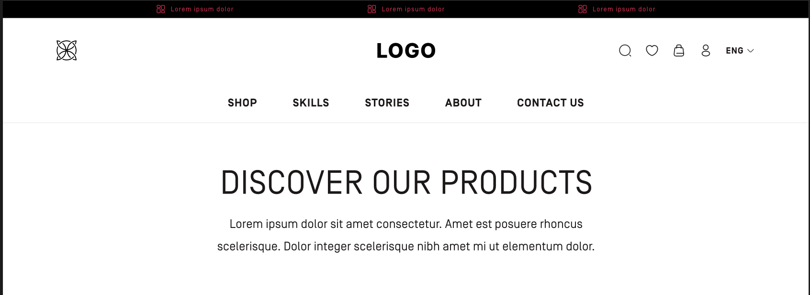
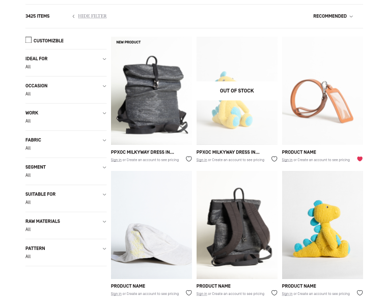
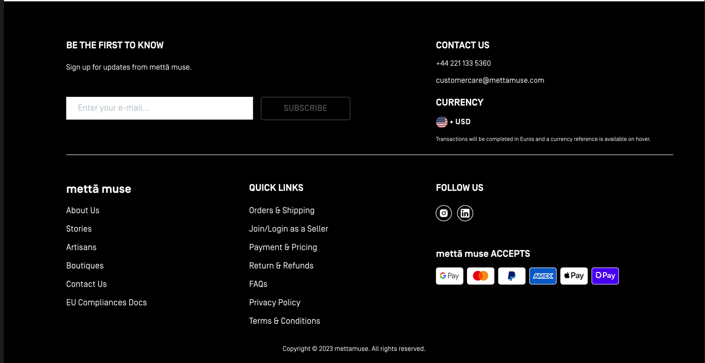

# Shopping App - AppScrip

**Shopping App** is a modern e-commerce web application built using ReactJS, Next.js, Redux, Axios, and RESTful APIs. This app provides users with a seamless shopping experience, featuring product browsing, cart management, and secure checkout. It is optimized for performance and ease of use on both mobile and desktop devices.

# Figma Design

`Link`: [Figma](https://www.figma.com/design/jexsbMEQDQCCuZaRCVUe0M/Design-Task---AppScrip?m=auto&t=HDP8KSXDkbGLgExL-6)

## Table of Contents📚

1. [Introduction🚀](#introduction)
2. [Features🛠️](#features)
3. [Tech Stack⚙️](#tech-stack)
4. [Screenshot📷](#screenshot)
5. [Getting Started🎯](#getting-started)
6. [Prerequisites📋](#prerequisites)
7. [Installation⚙️](#installation)
8. [Usage📈](#usage)
9. [Contributing❤️](#contributing)
10. [License📝](#license)

## Introduction🚀

**Shopping App** is designed to offer users a smooth and efficient online shopping experience. With a focus on responsive design, users can browse products, add them to their cart, and complete the checkout process easily. The app integrates with a RESTful API to fetch product data and manage user interactions like login, cart, and payments.

## Features🛠️

- **Product Listing:** Browse through a catalog of products with various categories.
- **Product Search:** Advanced search functionality to find specific products.
- **Cart Management:** Add and remove items from the shopping cart.
- **User Authentication:** Login and registration features for personalized user experience.
- **Checkout:** Secure and seamless checkout process.
- **Responsive Design:** Optimized for both desktop and mobile users.
- **API Integration:** Real-time data fetching for product listings and user interactions.

## Tech Stack⚙️

- **ReactJS:** For building the user interface and creating dynamic web pages.
- **Next.js:** For server-side rendering and optimizing the performance of the app.
- **Redux:** For state management across the application, making it easier to manage complex states.
- **Axios:** For handling HTTP requests and interacting with the backend API.
- **API:** RESTful API integration for fetching products, user data, and processing orders.

## Screenshot📷





# App Demo Link

`Demo`: [Link](appscrip-venkykumar.netlify.app)

## Getting Started🎯

To set up and run the **Shopping App** locally, follow these instructions:

1. Clone the repository to your local machine.
2. Install the required dependencies.
3. Configure your environment.
4. Start the application locally to explore the features.

## Prerequisites📋

- Node.js (version 14 or higher)
- npm or yarn
- A modern web browser

## Installation⚙️

1. Clone the repository:
   ```bash
   git clone https://github.com/BoddepallyVenkatesh06/AppScrip-Task-Venky_Kumar.git
   ```

2. Navigate to the project directory:
   ```bash
   cd shopping-app
   ```

3. Install dependencies:
   ```bash
   npm install
   ```
   or
   ```bash
   yarn install
   ```

4. Configure environment settings (create a `.env` file based on `.env.example`).

5. Start the application in development mode:
   ```bash
   npm run dev
   ```
   or
   ```bash
   yarn dev
   ```

6. Open the application in your browser at `http://localhost:3000`.

## Usage📈

- Browse products, search for items, and view details.
- Add items to the shopping cart and adjust quantities.
- Register and log in to save your cart and checkout.
- Complete the secure checkout process using a mock or real payment gateway.

## Contributing❤️

Contributions to **Shopping App** are welcome! To contribute:

1. Fork the repository.
2. Create a new branch for your changes.
3. Make your modifications and commit with clear messages.
4. Push your changes to your forked repository.
5. Submit a pull request with a detailed description of your changes.

## License📝

MIT License

Copyright (c) 2024 Venky Kumar

Permission is hereby granted, free of charge, to any person obtaining a copy
of this software and associated documentation files (the "Software"), to deal
in the Software without restriction, including without limitation the rights
to use, copy, modify, merge, publish, distribute, sublicense, and/or sell
copies of the Software, and to permit persons to whom the Software is
furnished to do so, subject to the following conditions:

The above copyright notice and this permission notice shall be included in all
copies or substantial portions of the Software.

THE SOFTWARE IS PROVIDED "AS IS", WITHOUT WARRANTY OF ANY KIND, EXPRESS OR
IMPLIED, INCLUDING BUT NOT LIMITED TO THE WARRANTIES OF MERCHANTABILITY,
FITNESS FOR A PARTICULAR PURPOSE AND NONINFRINGEMENT. IN NO EVENT SHALL THE
AUTHORS OR COPYRIGHT HOLDERS BE LIABLE FOR ANY CLAIM, DAMAGES OR OTHER
LIABILITY, WHETHER IN AN ACTION OF CONTRACT, TORT OR OTHERWISE, ARISING FROM,
OUT OF OR IN CONNECTION WITH THE SOFTWARE OR THE USE OR OTHER DEALINGS IN THE
SOFTWARE.
